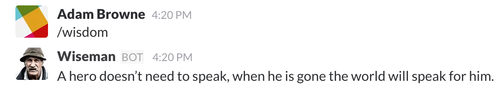

# wiseman
Wiseman is built off an extremely simple API, which just contains a large selection of wisemen sayings. The plan is to make it a fully functional Slack App. 

When the app is finished, it will look like this:

At its current stage, you can make a slack integration from this by doing the following:

Making a GET Request to https://wiseman-app.herokuapp.com/wise will return some wisdom.
The API's location will at some point be migrated to a larger host, and more sayings will be added.

Feel free to fork this and add some more sayings.
